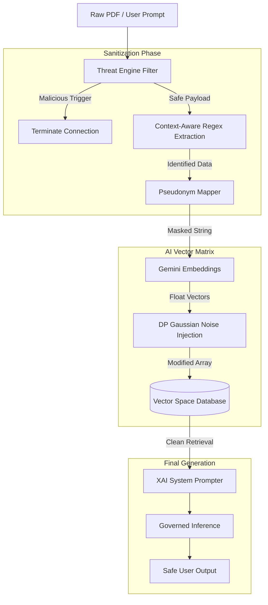

# 🏦 Secure RAG: Enterprise Banking Intelligence

> [!IMPORTANT]
> **Final Year Project** developed by Sai Manoj Yadav (Department of Computer Science & Information Technology).
> 
> This project introduces a secure, privacy-preserving **Retrieval-Augmented Generation (RAG)** architecture built exclusively for the stringent compliance requirements of the Banking and Financial Services sector.

---

## 🔒 The Vulnerability Problem

Standard Large Language Models (LLMs) combined with RAG frameworks frequently expose high-risk enterprise datasets to:
1. **Prompt Injections:** Hackers injecting "developer bypass commands" into uploaded PDFs to hijack the LLM orchestration.
2. **PII Data Leakage:** Unfiltered ingestion of credit cards, phone numbers, and bank account numbers into remote vector databases.
3. **Vector Embedding Inversion:** The mathematical reconstruction of original document text by analyzing dense distance mappings.

---

## 🛡️ Our Multi-Layered Defense Solution (Core Concepts)

This project actively defeats those vulnerabilities by implementing a **Defense-in-Depth** pipeline strictly enforcing deterministic control over unstructured AI data boundaries.

### 1. Pre-emptive Threat Engine
Every document upload and user query is parsed through a Lexical & Semantic Threat Engine designed to trap **Cross-Site Scripting (XSS), SQL Injections, and Prompt Injections**. If a malicious heuristic is tripped, the payload never reaches the AI model, and the user's connection is forcefully severed via an `O(1)` memory cache.

### 2. Context-Aware PII Pseudonymization
To securely index Indian financial data, advanced **Lookaround Regex** contextualizes and replaces 10-digit integers. It accurately isolates a `PAN Number` from an `Indian Phone Number` from a `Bank Account Number`, substituting them with mathematically isolated, salted tags (e.g. `[ACCOUNT_9A2B]`). This ensures zero sensitive data ever enters the vector space in plain text.

### 3. Differential Privacy (DP) Vectors
Upon reaching the Google Gemini Text Embedder, this backend injects calculated **Laplacian & Gaussian Noise (ε-DP)** into the float array. This mathematically nullifies Vector Inversion Attacks (hackers trying to reverse-engineer vectors back to English sentences) while safely retaining cosine similarity performance within the database.

### 4. Explainable AI (XAI) Citations
To resolve AI hallucinations, the final generative model is forced by strict system prompts to construct explicit Page Matrix correlations to the original PDFs. This ensures every piece of output data provided to the user is legally defensible and auditable.

---

## 🏛️ Concept Architecture

