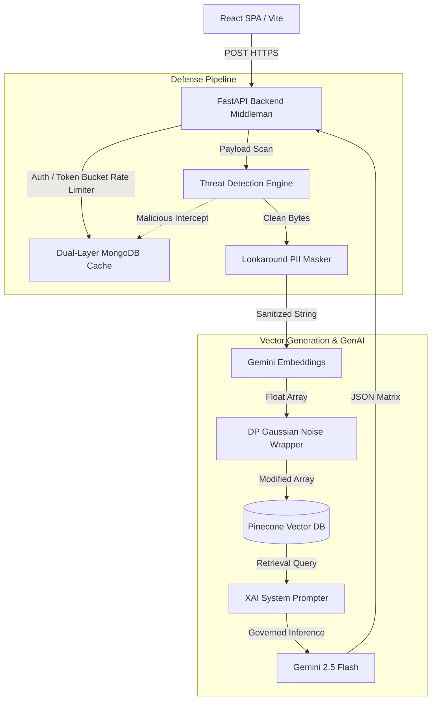

# 🏦 Secure RAG: Enterprise Banking Intelligence

> [!IMPORTANT]
> **Final Year Project** developed by Sai Manoj Yadav (Department of Computer Science & Information Technology).
> 
> This repository houses a radically secure, privacy-preserving **Retrieval-Augmented Generation (RAG)** architecture built exclusively for the stringent compliance requirements of the Banking and Financial Services sector.

[](https://reactjs.org/)
[](https://fastapi.tiangolo.com/)
[](https://www.mongodb.com/)
[](https://www.pinecone.io/)

---

## 🔒 The Vulnerability Problem

Standard Large Language Models (LLMs) combined with RAG frameworks frequently expose high-risk enterprise datasets to:
1. **Prompt Injections & Jailbreaks:** Hackers injecting "developer bypass commands" into uploaded documents to hijack the LLM orchestration.
2. **PII Data Leakage:** Unfiltered ingestion of credit cards, phone numbers, and bank account numbers into remote vector databases.
3. **Multi-Tenant Exfiltration:** Users manipulating the vector similarity calculations to retrieve data belonging to other organizations.
4. **Vector Embedding Inversion:** The mathematical reconstruction of original document text by analyzing dense distance mappings.

---

## 🛡️ Our Multi-Layered Defense Solution

This project actively defeats those vectors by implementing a **Defense-in-Depth** pipeline strictly enforcing deterministic control over unstructured AI data boundaries.

### 1. Pre-emptive Threat Engine (Dual-Layer Sync)
Every document upload and user query is parsed through a Lexical & Semantic Threat Engine designed to trap **Cross-Site Scripting (XSS), SQL Injections, and Prompt Injections**. If a user trips a malicious heuristic, they are instantly banned via an `O(1)` memory cache synced synchronously to a MongoDB persistence layer.

### 2. Context-Aware PII Pseudonymization
To securely index Indian financial data, advanced **Lookaround Regex** contextualizes and replaces 10-digit integers. It accurately isolates a `PAN Number` from an `Indian Phone Number` from a `Bank Account Number`, substituting them with mathematically isolated, salted tags (e.g. `[ACCOUNT_9A2B]`).

### 3. Differential Privacy (DP) Vectors
Upon reaching the Google Gemini Text Embedder, this backend injects calculated **Laplacian & Gaussian Noise (ε-DP)** into the float array. This mathematically nullifies Vector Inversion Attacks while safely retaining cosine similarity performance within the Pinecone database.

### 4. SIEM Audit Logging & XAI Citations
A dedicated **Master Admin Dashboard** strictly monitors an enterprise **Security Information and Event Management (SIEM)** stream generated directly to MongoDB. To resolve hallucinations, the final Gemini generation string is forced to construct explicit **Explainable AI (XAI)** Page Matrix correlations to the original PDFs.

---

## 🏛️ System Architecture



---

## 🚀 Deployment Guide (Vercel + Render)

This application has been securely refactored to hide all credentials by abstracting `os.getenv` into `.env` payloads, ensuring safe public internet deployment.

### 1. The Backend (Python / FastAPI)
The API runs efficiently on [Render.com](https://render.com) for free:
1. Link this repository to Render as a **Web Service**.
2. Root Directory: `backend`
3. Environment: `Python 3`
4. Start Command: `uvicorn main:app --host 0.0.0.0 --port 10000`
5. **CRITICAL:** Inside Render's "Environment Variables" tab, manually paste:
   - `GEMINI_API_KEY`
   - `PINECONE_API_KEY`
   - `MONGO_URI`
   - `SECRET_KEY`

### 2. The Frontend (React / Vite)
The User Interface deploys instantly via [Vercel](https://vercel.com/):
1. Import this GitHub repository into Vercel.
2. Root Directory: `frontend`
3. Framework: `Vite`
4. **CRITICAL:** Go to Environment Variables and add `VITE_API_URL` linking directly to your live `https://<your-render-app>.onrender.com` URL. (This tells React exactly where the Python server lives, eliminating `localhost` limitations).

---

## 📖 Local Installation

If you desire to run this locally on macOS or Linux:

**Terminal 1 (Backend):**
```bash
cd backend
python3 -m venv venv
source venv/bin/activate
pip install -r requirements.txt
uvicorn main:app --reload --port 8000
```

**Terminal 2 (Frontend):**
```bash
cd frontend
npm install
npm run dev
```

---

## 👨‍💻 Access Structure & Tech Stack
- **Languages:** JavaScript (ES6), Python 3.12+
- **Frontend Framework:** React 18, Vite.js
- **Backend Orchestrator:** FastAPI, PyJWT, bcrypt, uvicorn
- **Databases:** MongoDB Cloud Atlas, Pinecone Vector Servers
- **AI Core:** Google Deepmind `gemini-2.5-flash-lite`, Text-Embedding-004

#### System Roles:
- **Master Admin** (`admin`): Authorized to utilize User Management, audit SIEM tables, block/promote internal tenants, and upload Global Organization Policy PDFs.
- **General Admin**: Authorized exclusively to upload PDFs to the Pinecone indices.
- **User**: Restricted strictly to Natural Language querying against the securely parsed vector fragments.
